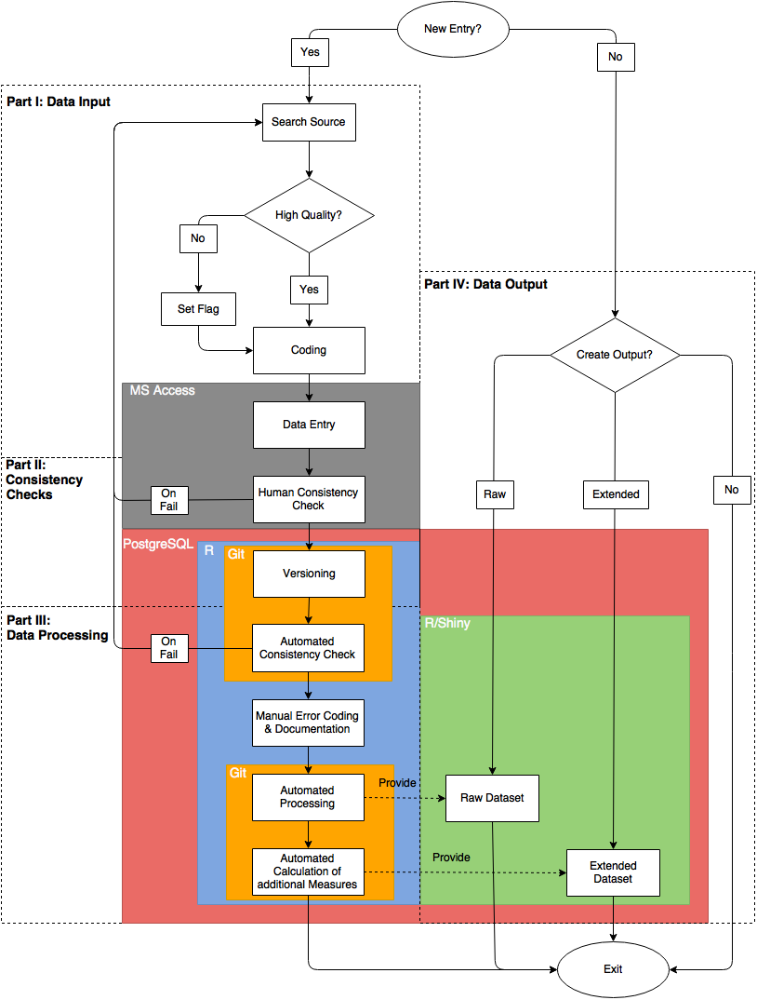

# Introduction

Our names are Werner Krause and Dag Tanneberg. We graduated in Political Science with a focus on Comparative Politics. Currently, we are pursuing our doctoral degrees at the research department "Democracy and Democratization" located at the Berlin Social Science Center WZB, Germany.

Much of the research at our department revolves around political competition, elections, and the dynamics of democratic government. In the mid-1990s senior fellows of our department decided to set up a permanent infrastructure offering data on elections and governments to all department members in a standardized and easily accessible format. Originally, the data were used to observe and analyze the consolidation processes in the then still young Eastern and Middle European democracies. The project has since grown into a database that includes more than eighty countries around the world between 1945 and today.

The database tracks numerous aspects of political competition. For instance, we code lower house and presidential election results, government duration, their size and composition as well as the ebb and flow of electoral alliances between political parties. Department members may output either raw data and digitized copies of our primary sources or summary statistics like turnout, the effective number of parties, measurements of disproportionality, and government stability.

Back in 2011 respectively 2008 we were recruited as research assistants to continue this longstanding project. We introduced several substantive and technological innovations into the database that sum to more streamlined, less error prone coding and data management routines. It was our goal to ensure transparency and reproducibility from the point of coding of individual parties in single elections to the point of generating summary statistics on every election covered between 1945 and today.

Broadly speaking, we understand reproducibility as the responsibility of researchers to provide sufficient detail on their work such that others using the same data and methods will be able to replicate their results, be those single statistics, graphs, tables or entire articles. Results that cannot be reproduced are neither open to critique nor revision -- they are unscientific.

In the context of our database reproducibility receives an even more demanding meaning. Since the quality of the data stored in our database affects numerous ongoing projects in- _and_ outside of our department every single piece of information should be reproducible. The challenge is thus to make the acquisition and coding of primary data as transparent to others as the standardized output we provide for secondary analyses.

# Workflow

Our team consists of one research assistant, two junior researchers, and one senior fellow. The research assistant is responsible for coding and entering the data. Moreover, she performs some baseline consistency checks. The junior researchers oversee both automated consistency checks and data processing. The senior fellow supervises the project. We confront three basic challenges when collecting, coding, and processing data: a) reduce coding errors, b) maintain a high degree of intercoder reliability, and c) provide transparency on the entire decision-making process. Each is discussed in the following.

Our workflow has four separate steps. First, data have to be acquired and coded manually. Second, codings go through different human supervised and automated consistency checks. Third, the newly generated data are processed before storing them in our back-end database. Finally, information can be outputted from our database. Technically, each step is independent of all others.

The first decision to be made is whether a new observation is to be added to the database. We collect information on all upcoming elections and governments in the 82 countries covered by our database. If a new entry is necessary, the coder will compile sources on party histories, election results and/or government events. At this point it is crucial to critically evaluate the quality of a source. It must be factually correct and should offer information that is as disaggregated as possible. The goal driving both requirements is correct and reliable coding of the data. To ease the burden on the research assistant a list of high quality print and digital sources is included in a codebook that accompanies the database. If high quality sources are available, information from other documents will be accepted. Such entries are flagged, however, in order to update them once high quality sources become available. For example, elections will be flagged if results are available as vote and seat shares only rather than absolute numbers. Once a source has been identified it is coded manually following the guidelines of detailed codebook.

Next, the research assistant enters the coded data into a _Microsoft Access_ frontend and she saves the source (including all coding decisions) on a server accessible to all users. _Access_ is neither free nor open, but it can be easily maintained and, more importantly, offers a user interface that makes data entry clear and easy. Via forms and reports the _Access_ interface establishes a standardized environment that reduces error and increases intercoder reliability. Moreover, the _Access_ interface performs basic consistency checks which enable the research assistant to evaluate the reliability of sources. One such routine verifies that the sum of absolute of votes equals the total number of valid votes as stated in the source. Another compares the total seat share of all government parties to the coded type of government. For example, minimum-wining coalitions with less than 50 per cent of the seats in parliament are immediately identified as problematic. Should any consistency check fail, new sources have to be consulted in order to reach an almost error-free result.

After the data has been entered, it is automatically exported to a PostgreSQL-Database. It allows us to store the entire dataset and to put it under version control using _Git_. Changes to the database are documented on a daily basis. At the same time, more complex automated consistency checks are performed. Those make use of the open source statistical software [_R_](https://www.r-project.org/). Using the _R_ package [_knitr_](http://yihui.name/knitr/)test results  are saved and sent as pdf to one of the junior researchers. Those reports document all new entries, but also all changes to the data, and all failed consistency checks. Consequently, the work of our research assistant can be easily tracked and potential coding errors are spotted almost immediately.

The automated reports serve as a basis for manual classification and documentation of errors. Despite our best efforts to collect data from high quality sources only, certain inconsistencies are unavoidable. For example, sometimes we cannot identify the number of seats in parliament controlled by a coalition government. This happens when government parties competed in different electoral coalitions for which seats won by each party are not available. These and other cases are identified automatically by _R_. Due to the wild variety of potential inconsistencies and their origins all suspicious entries are flagged and must be documented manually.

Finally, the data are processed in _R_. Data are joined from different tables and some variables are dropped in order to generate a raw dataset that includes all entries of the database. Additional operations are performed on the raw data to generate an extended dataset. The latter includes common summary statistics like turnout, the effective number of parties, etc.

After all these steps are finished we make both datasets accessible via a [_Shiny_](http://shiny.rstudio.com/) interface. It allows users to browse and download raw as well as processed data. It also possible to export the entire database including all coding decisions and flags.

Words: 814/800

# Pain points

Coding and documenting cases that do not fit our pre-defined coding scheme constitute one particular pain point of our workflow. For example, in many countries political parties and electoral alliances do not resemble the "well-behaved" party systems of Western Europe. Frequently changing electoral alliances, electoral pacts at the local level or the implosion of entire party systems as in Italy in the mid-1990s confront us with serious difficulties. Often identifying, coding, and documenting the electoral performance of political parties on a continuous basis is daunting. Moreover, those problematic cases are so multifaceted that it is almost impossible to capture them in a parsimonious set of error codes. Therefore, no explicit rule is given in the codebook, and every individual case needs to be explained separately. The final datasets contain all that information. Hence, deviations from the coding guidelines are at least made transparent to the user. 

A second pain point concerns the history of the database and inter-coder reliability. Often the current research assistant knows only a limited number of her predecessors. Consequently, there is little guarantee that coding decisions are made consistently across coder generations. Rather, each research assistant acquires highly individualized knowledge of coding decisions and problems which can never be exhaustively communicated between coder generations. In other words, although an extensive codebook exists intercoder reliability is necessarily limited. As a consequence, one recurrent task is  to review past codings in order to guarantee that information in our database stays consistent over time.

Words: 330/200-400

# Key benefits

One central concern of our workflow is to make data collection and processing transparent to the user. While numerous datasets on election results, government formation, and electoral systems exist, none document the coding process down to the level of the original source. In contrast, we provide users with a codebook listing all standardized coding decisions. Individual entries that do not fit those guidelines are highlighted and explained in the database output. Moreover, we offer the user the opportunity to review our original source along with our coding decisions. There are many ways to collect and aggregate data on political parties, elections and governments. However, only if the researcher is offered sufficient detail on the data and the decisions leading to its creation, can she critically evaluate how the data impact her results. Our approach combines transparency on sources, coding, and aggregation with different layers of consistency checks, error assessment and continuous monitoring. It establishes a unique level of reproducibility in the field of Comparative Politics.

Words: 245/200-400

# Key tools

The key tool of our workflow is the PostgreSQL-database. It allows us to efficiently store and version control our data. In contrast to Microsoft Access, which we use as a user interface for data entry, PostgreSQL is a object-relational database management system that comes free of charge. For its compatibility with _Microsoft Access_, _Git_, and _R_ (including _knitr_ and _Shiny_) PostgreSQL constitutes a very flexible tool. It allows automatic production of periodic reports on changes to the database and failed consistency checks. Moreover, PostgreSQL enables us to access all versions of the database and the corresponding _R_-scripts via a version control system (_git_). Hence, earlier versions of the database can quickly be reproduced allowing for the replication of data used in past analyses. PostgreSQL enables us to ensure high levels data quality and reproducibility.

Words: 171/200-400

# General questions about reproducibility

1. __Why do you think that reproducibility in your domain is important?__
  Political scientists learn from empirical experience. If
  contributions to our field are not transparent enough to be
  reproduced, then nothing can be learned from them. However,
  reproducibility covers both data generation and analysis.
  The Garbage-In-Garbage-Out principle applies to all studies
  that fail on either side of the equation.  
2. __How or where did you learn the reproducible practices described in your case study?__
  Some practices we use are standard and should be
  taught in every introductory methods class. Others we learned
  from more tech savvy colleagues. Magic happened once we put
  the two together.
3. __What do you see as the major pitfalls to doing reproducible research in your domain, and do you have any suggestions for working around these? Examples could include legal, logistical, human, or technical challenges.__
  We see two major pitfalls. First, political
  scientists often receive strong training in qualitative or
  quantitative methods, but not in basic data management.
  It is not unheard of that graduate students
  merge datasets row by row in Excel. Much would be gained
  if Political Science curriculae would teach key
  data management skills. Second, our field rewards
  productivity, not thoroughness. We finish one project and
  quickly move on, leaving procedures of data generation and
  analysis poorly documented. To ensure at least a minimal
  level of reproducibility the provision of replication
  packages containing raw data, data management and analysis
  scripts should be made mandatory.
4. __What do you view as the major incentives for doing reproducible research?__
  Political scientists learn from experience. Reproducible
  research establishes a baseline against which to compare
  future analyses and thus secures scientific progress. 
5. __Are there any broad reproducibility best practices that you'd recommend for researchers in your field?__
  Never change your raw data file. Stay away from the GUI.
  Have at least one notebook detailing the evolution of
  your analysis. Always comment your code or field notes.
6. __Would you recommend any specific websites, training courses, or books for learning more about reproducibility?__
